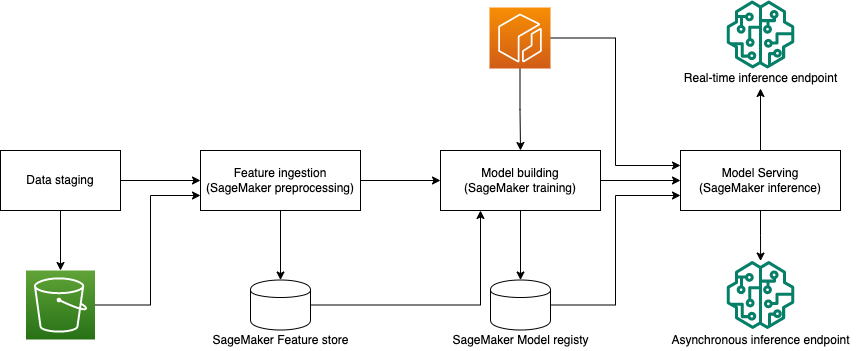

# End to End Pipeline: Bring your own container to SageMaker Pipelines

## Background
As machine learning algorithms update frequently, the built-in algorithms in SageMaker is hard to keep start-of-the-art. In order to use the latest machine learning algorithm with SageMaker, BYOC(Bring Your Own Container) will be an alternative. [Amazon SageMaker Pipelines](https://aws.amazon.com/sagemaker/pipelines/) is the first purpose-built, easy-to-use continuous integration and continuous delivery (CI/CD) service for machine learning (ML). SageMaker Pipelines with BYOC can bring the state-of-the-art algorithm to the production environment more effectively.

## Prerequisites
- Amazon SageMaker notebook instance of `ml.t3.medium` with 100GB EFS, as well as a role with policies of `AmazonSageMakerFullAccess`
- at latest one `ml.p3.16xlarge` instance limit for Training Job
- one `ml.p3.2xlarge` instance for batch inference
- one `ml.m5.xlarge` instance for processing jobs
- the region `us-east-1` is recommended

## Objective
This repository demonstrates how to create an end2end pipeline at BYOC mode with SageMaker Pipelines. it consists of the following parts:
- Feature ingestion
- Model building
- Real-time inference endpoint deployment
- Asynchronous inference endpoint deployment

## Solution
The whole architecture is like below:
<div align="center"></img></div>

## Dataset
In this repository, we use the dataset of [IMDB](https://ai.stanford.edu/~amaas/data/sentiment/) for text classification. In `tutorial.ipynb`, we use `wget` to download this dataset as below.
```bash
wget https://ai.stanford.edu/~amaas/data/sentiment/aclImdb_v1.tar.gz -O aclImdb_v1.tar.gz
```

## Security

See [CONTRIBUTING](CONTRIBUTING.md#security-issue-notifications) for more information.

## License

This library is licensed under the MIT-0 License. See the LICENSE file.
